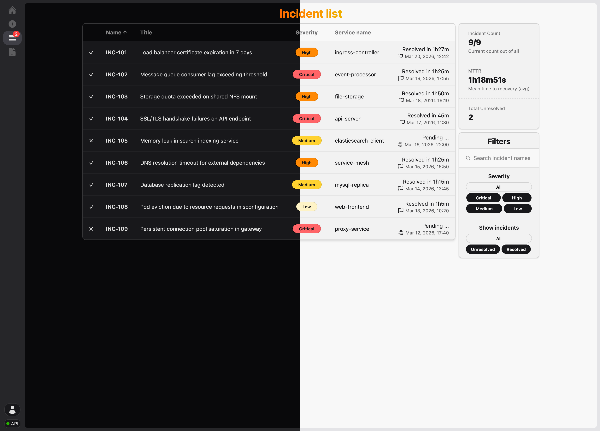
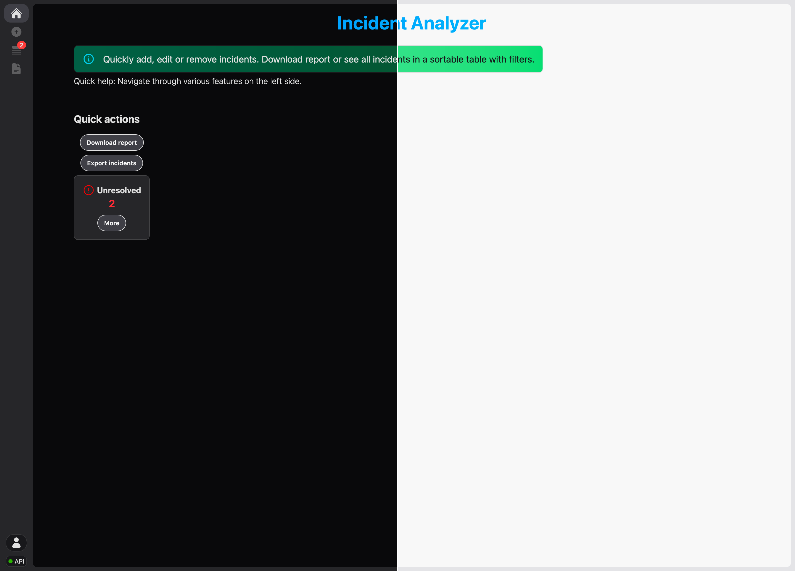
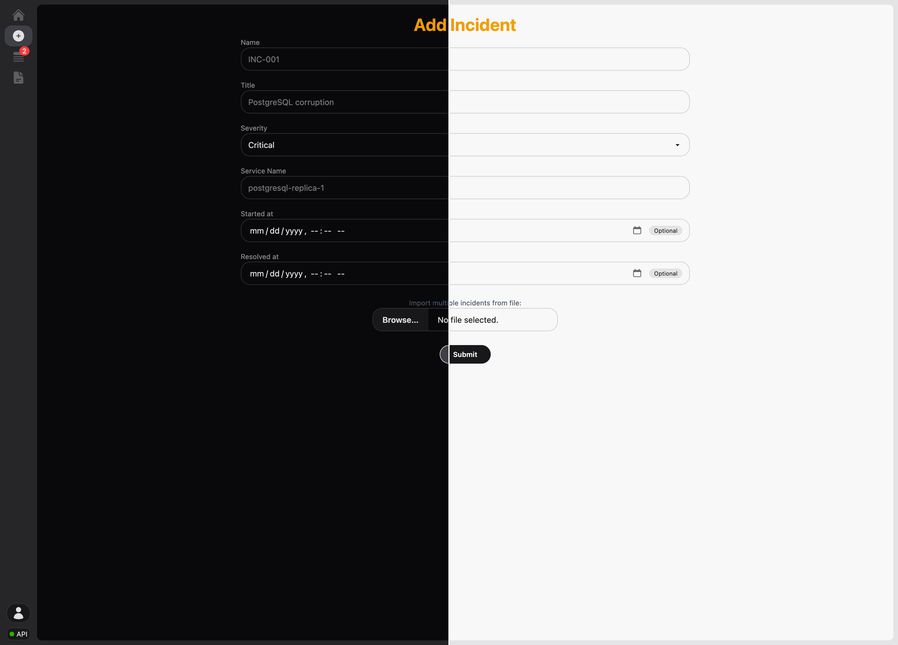
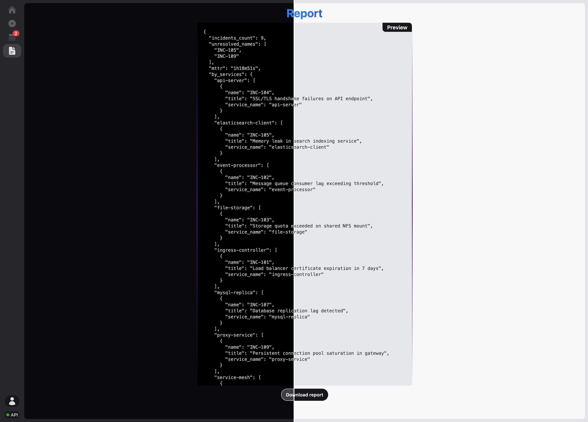
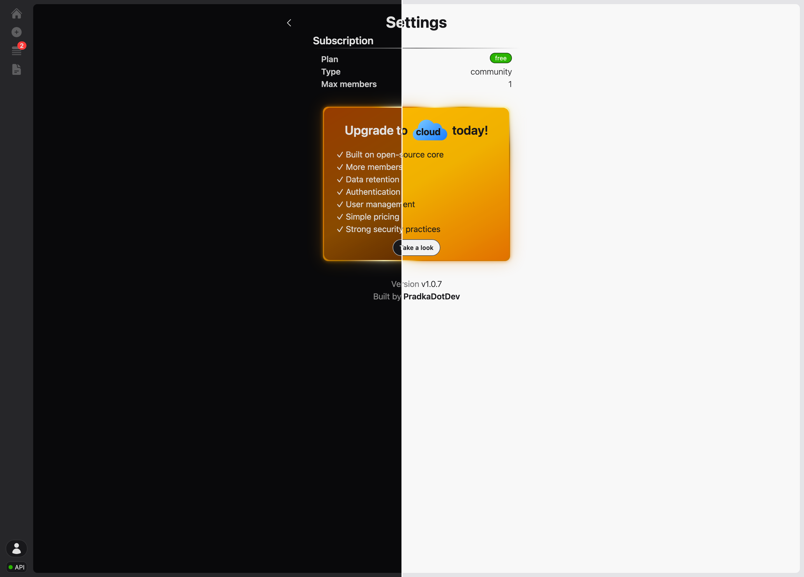

# Self-hosted, open-source incident management. Encrypted by default

## What is IMSy?



IMSy is a self-hostable, open-source incident management system. Add, edit and remove incidents, generate reports and browse everything in a sortable, filterable table.

## Table of contents

- [Self-hosted, open-source incident management. Encrypted by default](#self-hosted-open-source-incident-management-encrypted-by-default)
  - [What is IMSy?](#what-is-imsy)
  - [Table of contents](#table-of-contents)
  - [Features](#features)
  - [Prerequisites](#prerequisites)
  - [Try it in 90 seconds](#try-it-in-90-seconds)
    - [Import sample data (optional)](#import-sample-data-optional)
  - [Running with Postgres (persistent)](#running-with-postgres-persistent)
  - [Why is the image so small?](#why-is-the-image-so-small)
  - [REST API endpoints reference](#rest-api-endpoints-reference)
  - [Roadmap](#roadmap)
  - [Screenshots](#screenshots)
  - [Issues \& Contributing](#issues--contributing)

## Features

- Add, edit and remove incidents
- Sort, filter or search table of incidents
- Export reports
- Import, export your incidents
- Encrypted at rest by default
- Ships as a single binary - container image under 40 MB

## Prerequisites

- Docker and Docker Compose (or alternatives like Podman)

## Try it in 90 seconds

Runs entirely in memory. No database or configuration needed.

```bash
# create 'imsy' directory and download Docker Compose file into it.
mkdir imsy; cd imsy
curl -O https://raw.githubusercontent.com/POCOCZE/imsy/refs/heads/main/docker-compose.yml
docker compose up -d
```

In your browser access [localhost:8080](http://localhost:8080)

### Import sample data (optional)

1. Download **incidents.json** file from the root of the repository
2. Navigate to the very left and *click plus icon*
3. Import the file you downloaded and click *Submit* button
4. Navigate to the very left again and *click list icon*
5. You should see the imported incidents, which you can filter or sort as you want

## Running with Postgres (persistent)

```bash
# clone repository
git clone https://github.com/POCOCZE/imsy.git
cd imsy
# copy 'compose.env.example' environment file with a different name '.env'
cp compose.env.example .env
# edit environment file to you liking
nano .env
# run the containers
docker compose -f docker-compose-full.yml up -d
```

After that you should be able to access the app UI using: [localhost:8080](localhost:8080)

## Why is the image so small?

The backend compiles to a single static Go binary with no external
runtime dependencies. The frontend ships as static assets embedded in
that same binary - so the whole thing runs as one process, one image,
under 40 MB.

## REST API endpoints reference

| HTTP method | Endpoint name | Handler name | Note |
| ----------- | ------------- | ------------ | ---- |
| GET | `/api/healthz` | healthHandler | Backend status health |
| GET | `/api/report` | getReportHandler | Return incident report |
| GET | `/api/incidents` | getAllHandler | Return list of incidents |
| POST | `/api/incidents` | addListHandler | Retrives list of incidents |
| POST | `/api/incident` | addHandler | Retrives one incident |
| GET | `/api/incidents/{id}` | getByIDHandler | Return one incident by ID |
| DELETE | `/api/incidents/{id}` | deleteByIDHandler | Delete one incident by ID |

## Roadmap

- ✓ Multi-stage Dockerfile
- ✓ Add `docker-compose.yml`
- ✓ Tutorial how to run this tool
- ✓ Create OCI rootless images
- ✓ Gracefully shutdown on SIGTEM
- Switch from log.Printf to *slog*
- Create dedicated page for each incident when clicking on it
- Create Helm Chart for Kubernetes

## Screenshots






## Issues & Contributing

If you have any problems or ideas on other features to add, feel free to open an issue or create Pull Request.
